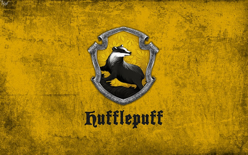

# Dom Hufflepuff

# Lista uczestników domu:
- [Krzysztof Adamczyk](https://github.com/krzychpoznan)
- [Wiktor Musiałkowski](https://github.com/WiktorM22)
- [Mateusz Kuczyński](https://github.com/MateuszKuczynskiAnalytics)
- [Natalia Dziwisz](https://github.com/Nalk4)

# Zasady współpracy:
1. **Nazywanie gałęzi**: _\`Imię_ZadanieX\`_, gdzie X - numer zadania.

2. **Przypisanie pierwszych kilku zadań**:
- Zadanie 0 - _\`Wiktor_Zadanie0\`_,
- Zadanie 1 - _\`Natalia_Zadanie1\`_,
- Zadanie 2 - _\`Krzysztof_Zadanie2\`_,
- Zadanie 3 - _\`Mateusz_Zadanie3\`_,
- Przypisanie do kolejnych zadań nastąpi wraz z czasem,
- ~~Każdy działa na własną rękę, nie współpracujemy~~,
- **Deadline** dla projektu - 19 maja 2024.
